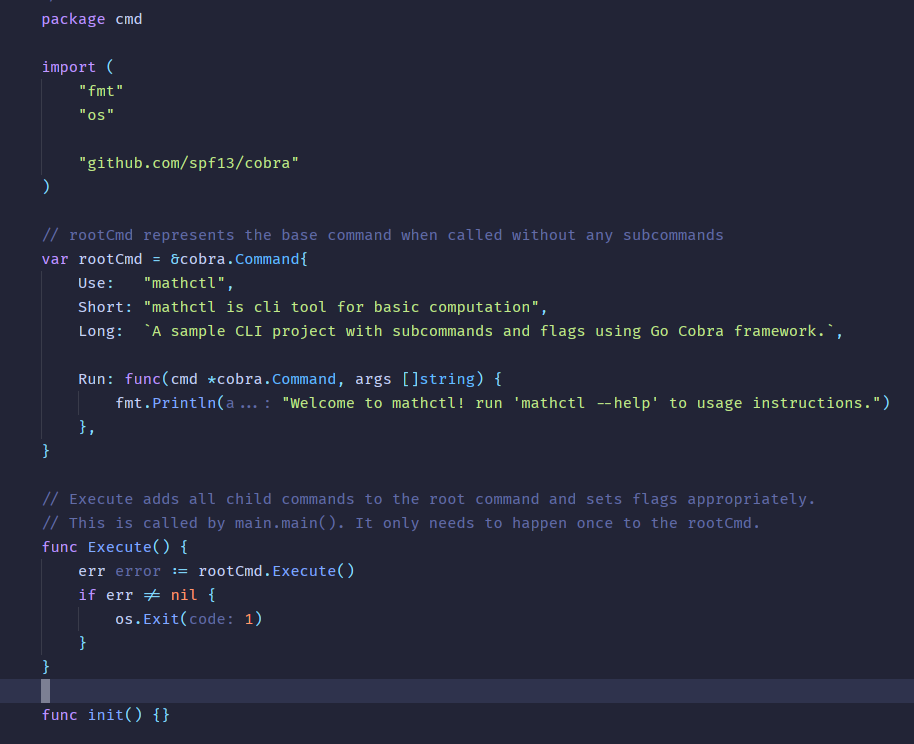
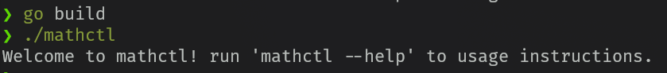
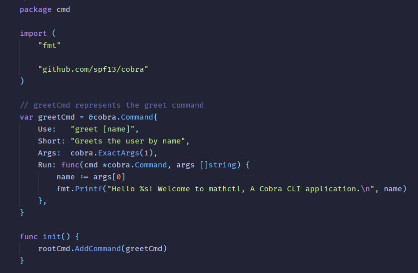
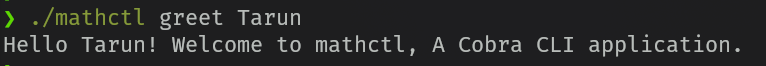
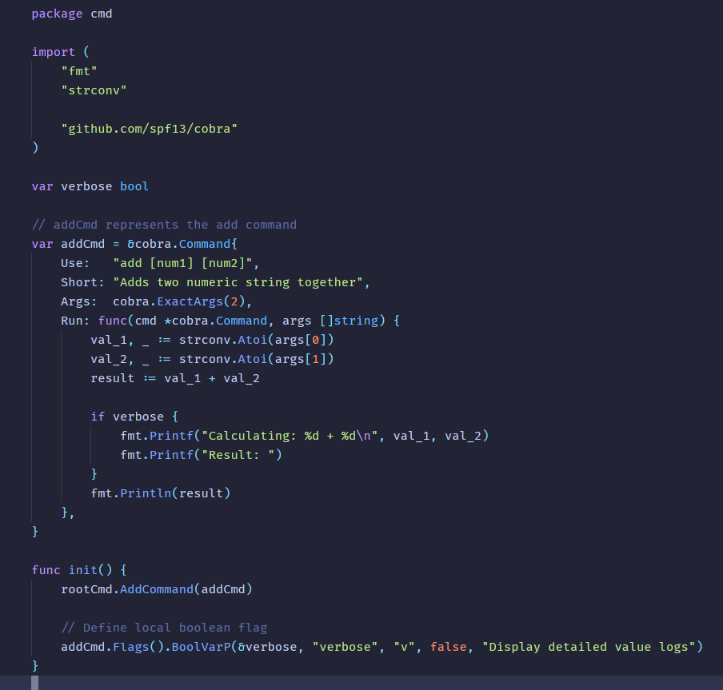
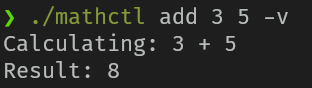

# Building a Powerful CLI Application in Go with Cobra

## Introduction
Command-line interface (CLI) tools are fundamental to modern developer workflows and DevOps automation. **Go (Golang)** has become the premier language for building CLI tools thanks to its blazing-fast startup time, cross-platform portability, and ability to compile into single, standalone binaries with zero external dependencies.

When building production-ready CLIs in Go, **Cobra** is the gold standard. It is the powerhouse behind industry-defining developer tools including **Kubernetes (`kubectl`)**, **GitHub CLI (`gh`)**, **Hugo**, and **Docker CLI**.

### Core Concepts
Cobra structures CLI applications around a simple, intuitive pattern:
- **Commands**: Represent actions to perform (e.g., `git clone`, `mathctl add`).
- **Args**: Represent items or values passed to commands (e.g., file paths, names).
- **Flags**: Represent modifiers or configuration options for actions (e.g., `--verbose`, `-p 8080`).

### Key Features
- **Nested Subcommands**: Easily build complex command hierarchies.
- **POSIX-Compliant Flags**: Support for both short (`-v`) and long (`--verbose`) flags.
- **Automated Help & Documentation**: Automatically generates `-h` / `--help` menus and man pages.
- **Intelligent Suggestions**: Provides "did you mean?" suggestions on misspelled commands.
- **Viper Integration**: Native compatibility with Viper for handling configs (YAML, JSON, ENV variables).
- **Code Generator**: The `cobra-cli` generator tool enables rapid scaffolding of projects and subcommands.

## Installation
The `cobra-cli` tool can be installed using Go with the following command:

``` bash
go install github.com/spf13/cobra-cli@latest
```

## Initial Configuration
An initial configuration file can be created at `~/.cobra.yaml` with the following contents:

``` yaml
author: Tarun Tehri <tehritarun@gmail.com>
year: 2026
license: MIT
```

## Create Go Project
Create a new directory and initialize the Go project:

``` bash
mkdir mathctl
cd mathctl
go mod init mathctl
```

## Install Cobra Library

``` bash
go get -u github.com/spf13/cobra@latest
```

## Create Cobra Project Scaffold
From within the Go project directory, run the following command:

``` bash
cobra-cli init
```

This will generate boilerplate code for the root command along with the following folder structure. At this point, you can open this project in your preferred code editor.

```
.
├── cmd
│   └── root.go
├── go.mod
├── go.sum
├── LICENSE
└── main.go
```

### Root Command
The code for the root command is located in `cmd/root.go`. Update its contents as shown below:



### Running the CLI
At this point, you can build and run the CLI using the following commands in your terminal:

``` bash
go build
./mathctl
```

You should see the following output:



## Add Subcommands
Subcommands can be added using the `cobra-cli add` command. In the following example, two subcommands (`greet` and `add`) are added:

``` bash
cobra-cli add greet
cobra-cli add add
```

This will generate two files under the `cmd` folder corresponding to each subcommand.

### Subcommand — greet
The `greet` subcommand greets the user by name, accepting the name as an input parameter.
The code for the `greet` subcommand is located in `cmd/greet.go`. Update its contents as shown below:



After updating the subcommand code, you can build and run it:



### Subcommand — add
The `add` subcommand demonstrates how to process positional arguments and parse custom flags. It adds two numbers provided as input arguments and accepts an optional `-v` / `--verbose` flag for detailed logging.

The code for the `add` subcommand is located in `cmd/add.go`. Update its contents as shown below:



> **💡 Key Takeaway**:
> - **Flags**: `cmd.Flags().BoolVarP(&verbose, "verbose", "v", false, "Enable verbose logging")` binds local short (`-v`) and long (`--verbose`) flags.
> - **Positional Args**: Arguments passed after the command are accessible via the `args []string` slice inside the command's `Run` function.

You can test this subcommand as shown below. You can also experiment with different combinations of flags and input parameters:



Similarly, you can use the `cobra-cli add` command to implement additional subcommands such as multiply, divide, and more.

## Conclusion & Next Steps
Cobra transforms Go CLI development from boilerplate-heavy script writing into a structured, scalable application architecture. With its intuitive command hierarchy, automated documentation, and seamless flag management, Cobra equips you to build everything from small developer utilities to enterprise-grade tools.

### What to Explore Next:
- **Persistent Flags**: Define global flags on the root command that cascade across all subcommands.
- **Viper Integration**: Automatically bind CLI flags to configuration files (YAML, JSON) and environment variables.
- **Shell Auto-completion**: Generate instant shell completion scripts for Bash, Zsh, Fish, and PowerShell using `cmd.GenBashCompletion()`.

---

*Found this tutorial helpful? Give it a 👏 on Medium and follow for more Go and cloud-native development guides! If you have any questions or ideas for additional subcommands, drop a comment below.*